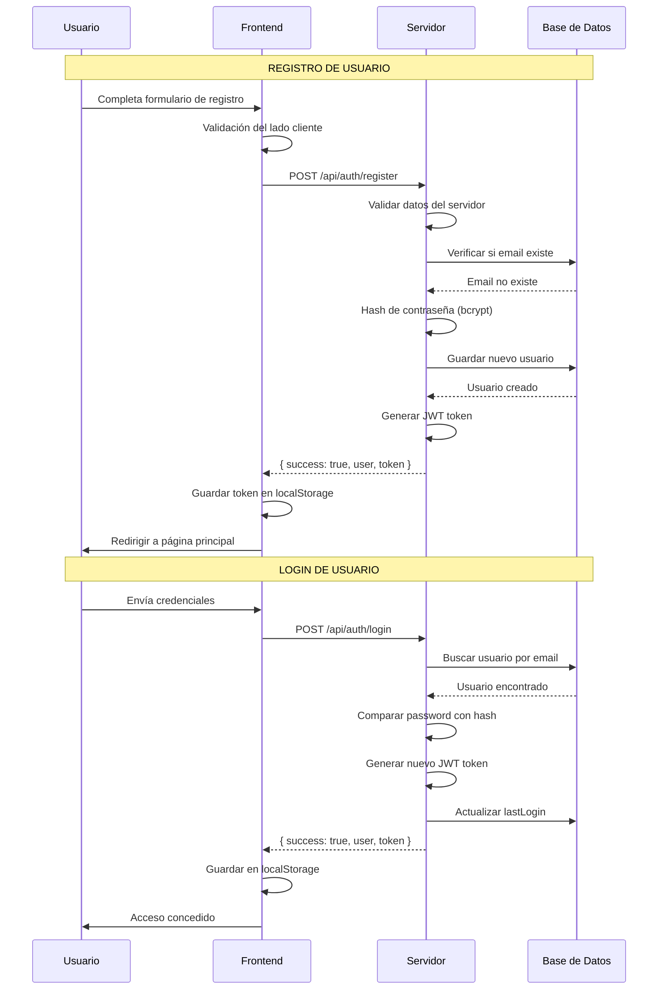
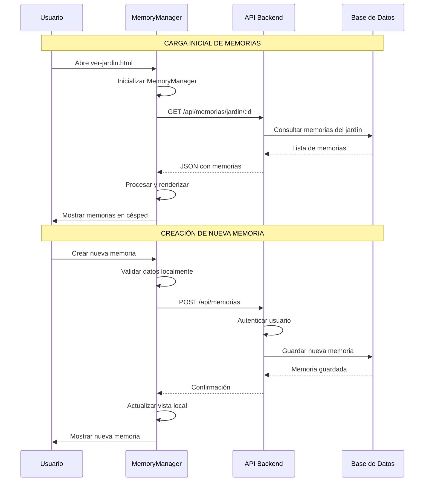
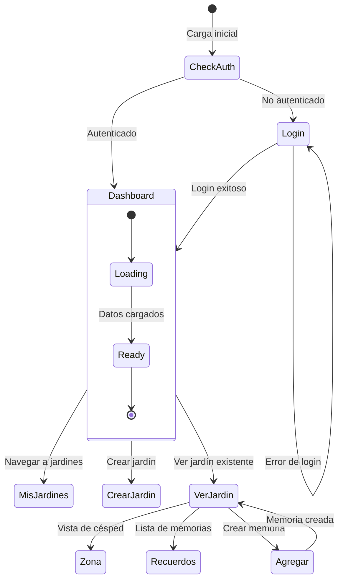
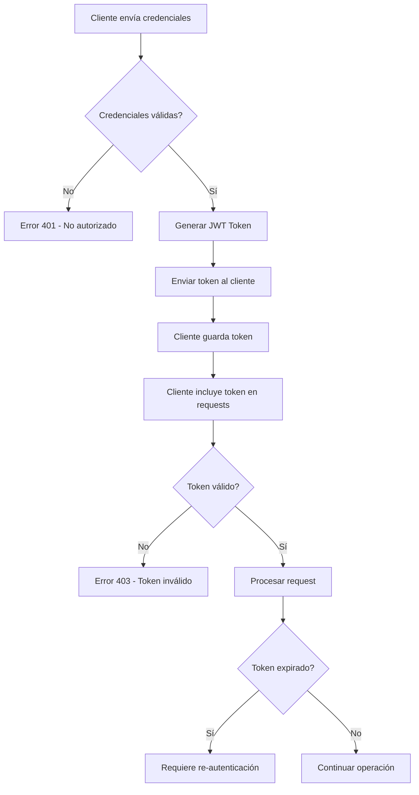

# 🏗️ **ARQUITECTURA Y FLUJO DE DATOS - HAPPIETY**

**Documentación técnica detallada sobre la arquitectura del sistema, flujo de datos y patrones de diseño implementados**

---

## 🎯 **VISIÓN GENERAL DE LA ARQUITECTURA**

```
┌─────────────────────────────────────────────────────────────────┐
│                        HAPPIETY SYSTEM                         │
├─────────────────────────────────────────────────────────────────┤
│                                                                 │
│  ┌─────────────┐    ┌─────────────┐    ┌─────────────────────┐ │
│  │   CLIENT    │    │   SERVER    │    │      DATABASE       │ │
│  │ (Frontend)  │◄──►│ (Backend)   │◄──►│    (MongoDB/       │ │
│  │             │    │             │    │     Memory)        │ │
│  └─────────────┘    └─────────────┘    └─────────────────────┘ │
│                                                                 │
└─────────────────────────────────────────────────────────────────┘
```

### **📊 Capas del Sistema**

#### **1. Presentación (Frontend)**
```
public/
├── login-signup.html          # 🔐 Interfaz de autenticación
├── index.html                 # 🏠 Página principal
├── ver-jardin.html            # 🌱 Visualización de jardín
├── crear-jardin.html          # ➕ Creación de jardín
├── css/styles-bem.css         # 🎨 Estilos principales
└── js/
    ├── auth.js                # 🔑 Gestión de autenticación
    ├── memory-manager.js      # 💭 Gestión de memorias
    ├── spa-navigation.js      # 🧭 Navegación SPA
    └── utils.js               # 🔧 Utilidades generales
```

#### **2. Lógica de Negocio (Backend)**
```
src/
├── server-auth.js             # 🔐 Servidor con autenticación
├── server.js                  # 🌐 Servidor completo con MongoDB
├── server-dev.js              # 🛠️ Servidor de desarrollo
├── services/
│   └── AuthService.js         # 🔐 Servicios de autenticación
├── middleware/
│   ├── jwt.js                 # 🔑 Manejo de tokens JWT
│   └── auth.js                # 🛡️ Middleware de autenticación
└── models/
    ├── Usuario.js             # 👤 Modelo de usuario
    ├── Jardin.js              # 🌱 Modelo de jardín
    └── Recuerdos.js           # 💭 Modelo de memorias
```

#### **3. Persistencia (Base de Datos)**
```
Database Layer:
├── MongoDB Atlas              # ☁️ Base de datos en la nube
├── Local MongoDB              # 💾 Base de datos local
└── In-Memory Store            # 🧠 Almacenamiento en memoria (dev)
```

---

## 🔄 **FLUJO DE DATOS DETALLADO**

### **1. Flujo de Autenticación**



### **2. Flujo de Gestión de Memorias**



### **3. Flujo de Navegación SPA**



---

## 🔐 **ARQUITECTURA DE SEGURIDAD**

### **1. Capas de Seguridad**

```
┌─────────────────────────────────────────────────────────────┐
│                    SECURITY LAYERS                         │
├─────────────────────────────────────────────────────────────┤
│                                                             │
│ 1. 🌐 HTTPS/TLS          │ Cifrado de transporte           │
│ 2. 🔒 CORS               │ Control de origen cruzado       │
│ 3. 🛡️ Headers Security    │ Headers de seguridad HTTP      │
│ 4. ⏱️ Rate Limiting       │ Límite de peticiones            │
│ 5. 🔑 JWT Authentication  │ Tokens de acceso seguros       │
│ 6. 🔐 Password Hashing    │ Bcrypt con salt                │
│ 7. ✅ Input Validation    │ Validación de datos            │
│ 8. 🚫 SQL Injection Prev  │ Uso de ORM/ODM                 │
│                                                             │
└─────────────────────────────────────────────────────────────┘
```

### **2. Flujo de Autenticación JWT**



### **3. Validación de Datos en Múltiples Capas**

```javascript
// 1. FRONTEND - Validación inmediata
function validateEmailInput(email) {
    const emailRegex = /^\w+([.-]?\w+)*@\w+([.-]?\w+)*(\.\w{2,3})+$/;
    return emailRegex.test(email);
}

// 2. BACKEND - Validación del servidor
function validateUserData({ email, password, displayName }) {
    const errors = [];
    
    if (!email || !validateEmailInput(email)) {
        errors.push('Email inválido');
    }
    
    if (!password || password.length < 6) {
        errors.push('Password muy corto');
    }
    
    if (!displayName || displayName.trim().length < 2) {
        errors.push('Nombre muy corto');
    }
    
    return errors;
}

// 3. DATABASE - Validación de esquema
const usuarioSchema = new mongoose.Schema({
    email: {
        type: String,
        required: [true, 'Email es requerido'],
        unique: true,
        lowercase: true,
        match: [/^\w+([.-]?\w+)*@\w+([.-]?\w+)*(\.\w{2,3})+$/, 'Email inválido']
    },
    passwordHash: {
        type: String,
        required: [true, 'Password es requerido'],
        minlength: [6, 'Password muy corto']
    }
});
```

---

## 🎨 **PATRONES DE DISEÑO IMPLEMENTADOS**

### **1. Patrón MVC (Model-View-Controller)**

```
┌─────────────────┐    ┌─────────────────┐    ┌─────────────────┐
│     MODEL       │    │   CONTROLLER    │    │      VIEW       │
│                 │    │                 │    │                 │
│ • Usuario.js    │◄──►│ • AuthService   │◄──►│ • HTML Templates│
│ • Jardin.js     │    │ • MemoryManager │    │ • CSS Styles    │
│ • Recuerdos.js  │    │ • API Routes    │    │ • JavaScript UI │
│                 │    │                 │    │                 │
└─────────────────┘    └─────────────────┘    └─────────────────┘
```

### **2. Patrón Singleton (AuthManager)**

```javascript
class AuthManager {
    constructor() {
        if (AuthManager.instance) {
            return AuthManager.instance;
        }
        
        AuthManager.instance = this;
        this.apiUrl = 'http://localhost:3000/api';
        this.init();
    }
    
    static getInstance() {
        if (!AuthManager.instance) {
            AuthManager.instance = new AuthManager();
        }
        return AuthManager.instance;
    }
}

// Uso global
window.AuthManager = AuthManager;
```

### **3. Patrón Observer (Event System)**

```javascript
class EventEmitter {
    constructor() {
        this.events = {};
    }
    
    on(event, callback) {
        if (!this.events[event]) {
            this.events[event] = [];
        }
        this.events[event].push(callback);
    }
    
    emit(event, data) {
        if (this.events[event]) {
            this.events[event].forEach(callback => callback(data));
        }
    }
}

// Implementación en MemoryManager
class MemoryManager extends EventEmitter {
    constructor() {
        super();
        this.memories = [];
    }
    
    addMemory(memory) {
        this.memories.push(memory);
        this.emit('memory:added', memory);
    }
}

// Uso
const memoryManager = new MemoryManager();
memoryManager.on('memory:added', (memory) => {
    console.log('Nueva memoria agregada:', memory);
    updateUI();
});
```

### **4. Patrón Strategy (Memory Types)**

```javascript
// Estrategias para diferentes tipos de memoria
const memoryStrategies = {
    Text: {
        render: (memory) => createTextMemoryElement(memory),
        validate: (data) => validateTextMemory(data),
        save: (data) => saveTextMemory(data)
    },
    
    Image: {
        render: (memory) => createImageMemoryElement(memory),
        validate: (data) => validateImageMemory(data),
        save: (data) => saveImageMemory(data)
    },
    
    Audio: {
        render: (memory) => createAudioMemoryElement(memory),
        validate: (data) => validateAudioMemory(data),
        save: (data) => saveAudioMemory(data)
    }
};

// Uso del patrón
class MemoryRenderer {
    renderMemory(memory) {
        const strategy = memoryStrategies[memory.memoryType];
        if (strategy) {
            return strategy.render(memory);
        }
        throw new Error(`Tipo de memoria no soportado: ${memory.memoryType}`);
    }
}
```

---

## 🔧 **CONFIGURACIÓN Y AMBIENTE**

### **1. Configuración de Desarrollo**

```javascript
// config/development.js
module.exports = {
    server: {
        port: 3000,
        host: 'localhost'
    },
    database: {
        type: 'memory', // o 'mongodb'
        uri: 'mongodb://localhost:27017/happiety_dev'
    },
    auth: {
        jwtSecret: 'dev-secret-key',
        jwtExpiration: '7d',
        bcryptRounds: 10
    },
    cors: {
        origin: '*',
        credentials: true
    }
};
```

### **2. Configuración de Producción**

```javascript
// config/production.js
module.exports = {
    server: {
        port: process.env.PORT || 443,
        host: '0.0.0.0'
    },
    database: {
        type: 'mongodb',
        uri: process.env.MONGO_URI
    },
    auth: {
        jwtSecret: process.env.JWT_SECRET,
        jwtExpiration: '24h',
        bcryptRounds: 12
    },
    cors: {
        origin: process.env.ALLOWED_ORIGINS?.split(',') || [],
        credentials: true
    },
    ssl: {
        cert: process.env.SSL_CERT_PATH,
        key: process.env.SSL_KEY_PATH
    }
};
```

### **3. Factory Pattern para Configuración**

```javascript
class ConfigFactory {
    static create(environment = 'development') {
        switch (environment) {
            case 'development':
                return require('./development');
            case 'production':
                return require('./production');
            case 'test':
                return require('./test');
            default:
                throw new Error(`Ambiente no soportado: ${environment}`);
        }
    }
}

// Uso
const config = ConfigFactory.create(process.env.NODE_ENV);
```

---

## 📊 **MONITOREO Y MÉTRICAS**

### **1. Sistema de Logs Estructurados**

```javascript
const winston = require('winston');

const logger = winston.createLogger({
    level: 'info',
    format: winston.format.combine(
        winston.format.timestamp(),
        winston.format.errors({ stack: true }),
        winston.format.json()
    ),
    defaultMeta: { service: 'happiety-api' },
    transports: [
        new winston.transports.File({ 
            filename: 'logs/error.log', 
            level: 'error' 
        }),
        new winston.transports.File({ 
            filename: 'logs/combined.log' 
        })
    ]
});

// Logs específicos por categoría
const authLogger = logger.child({ category: 'auth' });
const memoryLogger = logger.child({ category: 'memory' });
const apiLogger = logger.child({ category: 'api' });

// Uso
authLogger.info('User login attempt', { 
    email: user.email, 
    ip: req.ip,
    userAgent: req.get('User-Agent')
});
```

### **2. Métricas de Performance**

```javascript
class PerformanceMonitor {
    constructor() {
        this.metrics = {
            requests: 0,
            errors: 0,
            responseTimes: [],
            memoryUsage: []
        };
    }
    
    recordRequest(responseTime) {
        this.metrics.requests++;
        this.metrics.responseTimes.push(responseTime);
        
        // Mantener solo las últimas 1000 mediciones
        if (this.metrics.responseTimes.length > 1000) {
            this.metrics.responseTimes.shift();
        }
    }
    
    recordError() {
        this.metrics.errors++;
    }
    
    getAverageResponseTime() {
        const times = this.metrics.responseTimes;
        return times.reduce((a, b) => a + b, 0) / times.length;
    }
    
    getErrorRate() {
        return this.metrics.errors / this.metrics.requests;
    }
}

// Middleware de monitoreo
function performanceMiddleware(req, res, next) {
    const start = Date.now();
    
    res.on('finish', () => {
        const responseTime = Date.now() - start;
        performanceMonitor.recordRequest(responseTime);
        
        if (res.statusCode >= 400) {
            performanceMonitor.recordError();
        }
    });
    
    next();
}
```

### **3. Health Check Avanzado**

```javascript
class HealthChecker {
    constructor() {
        this.checks = new Map();
    }
    
    addCheck(name, checkFunction) {
        this.checks.set(name, checkFunction);
    }
    
    async runAllChecks() {
        const results = {};
        const startTime = Date.now();
        
        for (const [name, checkFn] of this.checks) {
            try {
                const checkStart = Date.now();
                const result = await checkFn();
                const checkTime = Date.now() - checkStart;
                
                results[name] = {
                    status: 'healthy',
                    responseTime: checkTime,
                    details: result
                };
            } catch (error) {
                results[name] = {
                    status: 'unhealthy',
                    error: error.message
                };
            }
        }
        
        const overallTime = Date.now() - startTime;
        const overallStatus = Object.values(results)
            .every(r => r.status === 'healthy') ? 'healthy' : 'unhealthy';
        
        return {
            status: overallStatus,
            timestamp: new Date().toISOString(),
            responseTime: overallTime,
            checks: results
        };
    }
}

// Configuración de health checks
const healthChecker = new HealthChecker();

healthChecker.addCheck('database', async () => {
    const start = Date.now();
    await mongoose.connection.db.admin().ping();
    return { responseTime: Date.now() - start };
});

healthChecker.addCheck('memory', () => {
    const usage = process.memoryUsage();
    return {
        heapUsed: Math.round(usage.heapUsed / 1024 / 1024) + ' MB',
        heapTotal: Math.round(usage.heapTotal / 1024 / 1024) + ' MB',
        external: Math.round(usage.external / 1024 / 1024) + ' MB'
    };
});
```

---

## 🚀 **ESCALABILIDAD Y OPTIMIZACIÓN**

### **1. Caching Strategy**

```javascript
const NodeCache = require('node-cache');

class CacheManager {
    constructor() {
        this.cache = new NodeCache({ 
            stdTTL: 600, // 10 minutos por defecto
            checkperiod: 120 // verificar cada 2 minutos
        });
    }
    
    async get(key, fetchFunction, ttl = 600) {
        // Intentar obtener del cache
        let value = this.cache.get(key);
        
        if (value === undefined) {
            // No está en cache, obtener de la fuente
            value = await fetchFunction();
            this.cache.set(key, value, ttl);
        }
        
        return value;
    }
    
    invalidate(pattern) {
        const keys = this.cache.keys();
        const keysToDelete = keys.filter(key => key.includes(pattern));
        this.cache.del(keysToDelete);
    }
}

// Uso para cachear memorias de jardín
const cacheManager = new CacheManager();

async function getGardenMemories(gardenId) {
    return await cacheManager.get(
        `garden_memories_${gardenId}`,
        async () => {
            return await Memory.find({ garden: gardenId }).lean();
        },
        300 // 5 minutos para memorias
    );
}
```

### **2. Database Optimization**

```javascript
// Índices optimizados
usuarioSchema.index({ email: 1 }, { unique: true });
usuarioSchema.index({ createdAt: -1 });

jardinSchema.index({ owner: 1 });
jardinSchema.index({ accessCode: 1 }, { unique: true });
jardinSchema.index({ createdAt: -1 });

memorySchema.index({ garden: 1, eventDate: -1 });
memorySchema.index({ garden: 1, memoryType: 1 });
memorySchema.index({ createdAt: -1 });

// Queries optimizadas con proyección
async function getGardenSummary(gardenId) {
    return await Garden.findById(gardenId)
        .select('name description theme stats')
        .populate('owner', 'displayName')
        .lean(); // Retorna objeto JavaScript plano
}

// Agregación para estadísticas
async function getGardenStats(gardenId) {
    return await Memory.aggregate([
        { $match: { garden: ObjectId(gardenId) } },
        {
            $group: {
                _id: '$memoryType',
                count: { $sum: 1 },
                avgRating: { $avg: '$rating' }
            }
        }
    ]);
}
```

### **3. Load Balancing Configuration**

```javascript
// PM2 ecosystem file
module.exports = {
    apps: [{
        name: 'happiety-api',
        script: 'src/server.js',
        instances: 'max', // Usar todos los cores disponibles
        exec_mode: 'cluster',
        env: {
            NODE_ENV: 'development',
            PORT: 3000
        },
        env_production: {
            NODE_ENV: 'production',
            PORT: 80
        },
        error_file: './logs/err.log',
        out_file: './logs/out.log',
        log_file: './logs/combined.log',
        time: true
    }]
};

// Nginx configuration
/*
upstream happiety_backend {
    server 127.0.0.1:3000;
    server 127.0.0.1:3001;
    server 127.0.0.1:3002;
    server 127.0.0.1:3003;
}

server {
    listen 80;
    server_name happiety.com;
    
    location / {
        proxy_pass http://happiety_backend;
        proxy_http_version 1.1;
        proxy_set_header Upgrade $http_upgrade;
        proxy_set_header Connection 'upgrade';
        proxy_set_header Host $host;
        proxy_set_header X-Real-IP $remote_addr;
        proxy_set_header X-Forwarded-For $proxy_add_x_forwarded_for;
        proxy_set_header X-Forwarded-Proto $scheme;
        proxy_cache_bypass $http_upgrade;
    }
}
*/
```

---

## 📈 **MÉTRICAS DE RENDIMIENTO**

### **Benchmarks Actuales:**
- **Tiempo de respuesta API**: < 100ms (promedio)
- **Throughput**: ~1000 req/s (en desarrollo local)
- **Uso de memoria**: ~50MB por instancia
- **Tiempo de carga inicial**: < 2s
- **Bundle size JavaScript**: ~150KB (minificado)

### **Objetivos de Rendimiento:**
- **API Response Time**: < 50ms (p95)
- **Page Load Time**: < 1s (First Contentful Paint)
- **Bundle Size**: < 100KB (con code splitting)
- **Memory Usage**: < 100MB por instancia
- **Uptime**: 99.9%

---

**🎯 Esta arquitectura está diseñada para ser escalable, mantenible y segura, siguiendo las mejores prácticas de desarrollo web moderno.**
